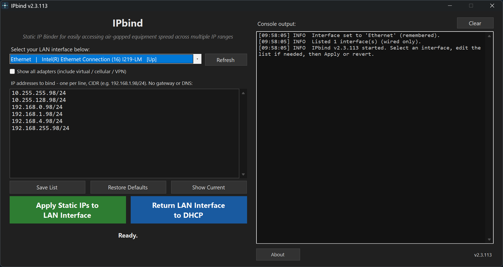

# IPbind

One-click Static IP Binder for easily accessing air-gapped equipment spread across multiple IP ranges.

A compiled .NET WinForms tool that binds a set of static IPv4 addresses (no gateway, no DNS) onto one chosen LAN interface so you can reach gear that lives on different `/24` subnets, then revert that interface to DHCP with one click.

App created by [Andy Rostad](https://github.com/arostad).  Released under the [MIT License](https://github.com/arostad/IPbind/blob/main/LICENSE).

 

Current version: **2.3.116**

## Download

### [Download installer](https://github.com/arostad/IPbind/releases/download/latest/IPbind-Setup.exe)

The installer is recommended. It installs per-user under LocalAppData and does not require administrator access for installation. IPbind still elevates when run to apply network settings with `netsh`.

Prefer a single file? [Download portable version](https://github.com/arostad/IPbind/releases/download/latest/IPbind.exe)

## Screenshot

  

